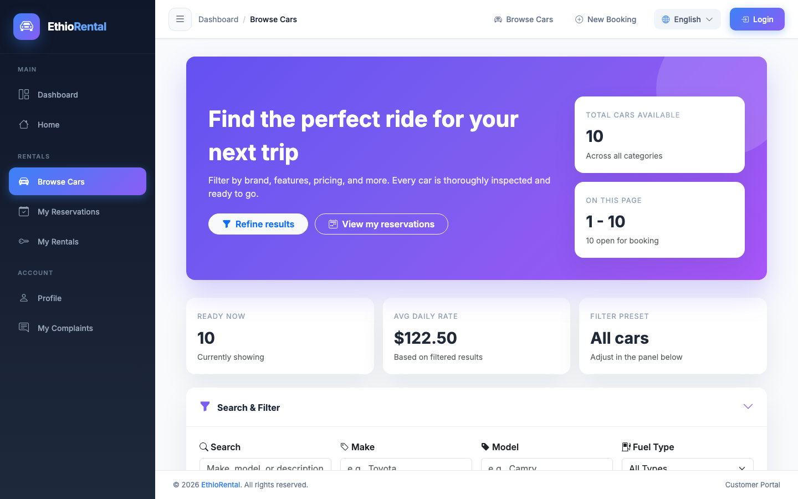
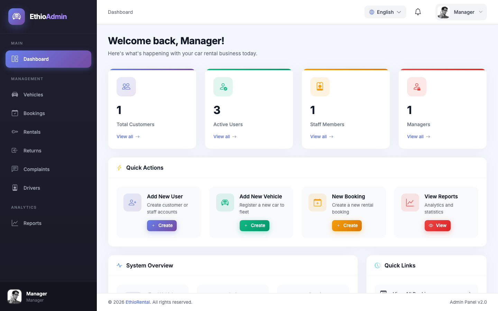
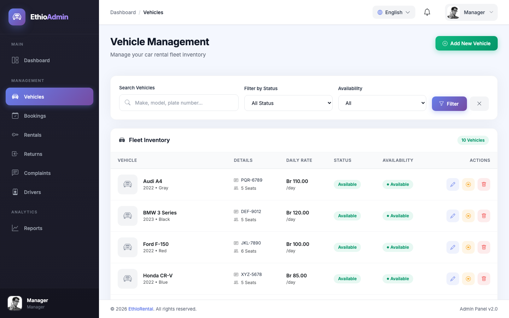

# Carola Car Rental Management System

A Laravel application for managing the complete car-rental lifecycle: browsing vehicles, making reservations, processing payments, converting approved reservations into rentals, assigning drivers, handling returns and overdue charges, and administering the platform through role-based dashboards.

## Application preview

| Customer landing page | Vehicle catalogue |
| --- | --- |
|  |  |

| Administration dashboard | Fleet management |
| --- | --- |
|  |  |

## What it demonstrates

- Domain-driven Laravel application with controllers, models, policies, services, notifications, and migrations
- Role-based access for customers, staff, managers, and administrators
- Reservation, rental, return, and overdue-payment workflows
- Third-party payment initialization and verification through Chapa
- Database-backed notifications and administrative activity logs
- PDF receipt generation
- Server-rendered responsive interfaces with Blade and Vite

## Main capabilities

### Customer

- Register, sign in, and maintain profile and driving-licence information
- Browse available vehicles and create reservations
- Pay for reservations through Chapa and download PDF receipts
- Track active rentals, submit returns, and pay overdue charges
- Submit and follow customer complaints

### Operations staff

- Manage the vehicle catalogue and availability
- Review reservations and update their status
- Approve payments and convert reservations into rentals
- Assign drivers and process vehicle returns
- Review complaints, reports, and operational notifications

### Administration

- Manage users and account status
- Maintain system settings
- Review and clear activity logs
- Control privileged routes through middleware and authorization policies

## Architecture

```text
Blade views
  -> Laravel web routes
  -> controllers and authorization policies
      -> Eloquent models -> relational database
      -> ChapaService -> Chapa API
      -> notifications / activity logs
      -> DomPDF receipts
```

| Area | Technology |
| --- | --- |
| Backend | PHP 8.2+, Laravel 12 |
| Frontend | Blade, Tailwind CSS, JavaScript, Vite |
| Data | Eloquent ORM, SQLite by default; MySQL-compatible configuration |
| Payments | Chapa API |
| Documents | DomPDF |
| Testing | PHPUnit / Laravel test runner |

## Project layout

```text
app/
  Http/Controllers/       Customer and administrative workflows
  Http/Middleware/        Role and access checks
  Models/                 Core domain entities
  Notifications/          Booking, complaint, driver, and rental events
  Policies/               Resource authorization
  Services/ChapaService   Payment-provider integration
database/
  migrations/             Database schema history
  seeders/                Roles, sample users, settings, and vehicles
resources/views/          Blade pages and email/document views
routes/web.php            Public, authenticated, and administrative routes
tests/                    Feature and unit tests
```

## Getting started

### Requirements

- PHP 8.2 or newer
- Composer
- Node.js 20 or newer
- SQLite or MySQL

### Installation

```bash
git clone https://github.com/seidmengistu/online-Car-rental-management-system.git
cd online-Car-rental-management-system
composer install
cp .env.example .env
php artisan key:generate
touch database/database.sqlite
php artisan migrate --seed
npm install
```

The supplied environment template uses SQLite. To use MySQL, update the `DB_*` variables in `.env` before running migrations.

Start the application, queue worker, logs, and Vite development server together:

```bash
composer run dev
```

Alternatively, run the Laravel and Vite servers separately:

```bash
php artisan serve
npm run dev
```

## Development accounts

`php artisan migrate --seed` creates sample accounts for local development:

| Role | Email | Password |
| --- | --- | --- |
| Customer | `customer@example.com` | `password` |
| Staff | `staff@carrental.com` | `password` |
| Manager | `manager@carrental.com` | `password` |

These credentials are for local development only. Do not seed them into a public production environment.

## Optional Chapa configuration

Add the following values to `.env` to enable live payment flows:

```env
CHAPA_PUBLIC_KEY=
CHAPA_SECRET_KEY=
CHAPA_ENCRYPTION_KEY=
CHAPA_BASE_URL=https://api.chapa.co
```

Without valid Chapa credentials, the rest of the application can still be reviewed locally, but payment initialization and verification will not complete.

## Tests and quality checks

```bash
php artisan test
./vendor/bin/pint --test
npm run build
```

The current suite provides baseline coverage. Reservation, payment, authorization, and rental-state transitions are the highest-priority areas for further automated testing.

## Security notes

- Laravel hashes passwords and provides CSRF protection for web forms.
- Middleware and policies protect role-specific and resource-specific actions.
- Payment completion is confirmed through provider-side transaction verification.
- Keep `.env`, payment credentials, application keys, and production data out of version control.
- Replace seeded credentials and disable debug mode in production.

Additional authentication details are available in [AUTHENTICATION_README.md](AUTHENTICATION_README.md).

## Author

[Seid Mengistu](https://github.com/seidmengistu)
